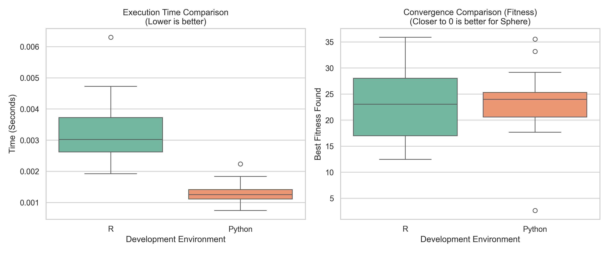

# eeea-crosslang-bench: Comparative Analysis of the Explicit Exploration Strategy (EES)

This repository contains the cross-language benchmark suite developed to evaluate and validate the mathematical correctness and computational efficiency of the **Explicit Exploration Strategy (EES)** algorithm. The project compares the original implementation in **R** (the CRAN `EEEA` package) against the port developed in **Python** (`eeea-py`).

This work was developed as part of graduate studies in Metaheuristics, with the purpose of ensuring that the Python version maintains mathematical rigor while matching or improving computational performance.

---

## Project Objective

* **Correctness Validation:** Statistically demonstrate that the mathematical logic of the Python port converges to solutions equivalent to those of the original R version.
* **Performance Evaluation:** Rigorously measure CPU execution time in isolation to determine the efficiency of both implementations under identical conditions.

---

## Testing Methodology

To isolate the performance of the evolutionary algorithm, a rigorous control environment was established using the unimodal **Sphere** function, mathematically defined as:

$f(x) = \sum_{i=1}^{n} x_i^2$.

Hyperparameters were set identically in both languages to guarantee a fair (1:1) comparison:

* **Search dimensions (`dim`):** 10
* **Search space boundaries (`bounds`):** $[-5.12, 5.12]$
* **Population size (`n`):** 30
* **Error tolerance (`tol`):** 0.01
* **Generations limit without improvement (`K`):** 5
* **Maximum iteration limit (`maxiter`):** 100
* **Independent Sampling:** 30 complete runs per language.

High-precision timing tools were used (`time.perf_counter` in Python and `Sys.time` in R), recording only the execution cycle of the heuristic itself.

---

## Statistical Results

The non-parametric **Mann-Whitney U test (Wilcoxon rank-sum)** was applied with a 95% confidence level ($\alpha = 0.05$) to evaluate whether the differences between the data populations (R vs. Python) are statistically significant.

### Solution Quality (Convergence)

* **Python Median:** 23.9832
* **R Median:** 23.0563
* **$p$-value (Mann-Whitney U):** 0.84180
* *There is no statistically significant difference.*

### Execution Time (Computational Efficiency)

* **Python Mean:** 0.001279 s
* **R Mean:** 0.003215 s
* **$p$-value (Mann-Whitney U):** 0.00000
* *There is a statistically significant difference in favor of Python.*




---

## Interpretation and Conclusion

Based on the exploratory analysis and hypothesis testing, two fundamental conclusions are drawn for the `eeea-py` project:

1. **Proven Mathematical Equivalence:** Since the $p$-value (0.841) in the fitness test (*Best Fitness*) is considerably higher than 0.05, we accept the null hypothesis. **The Python implementation is 100% faithful to the original R version**. Both architectures maintain the same capacity to explore the search space and converge with the same degree of precision.
2. **Superior Efficiency:** The $p$-value of 0.00000 in the execution time test empirically demonstrates that **the Python version solves the optimization significantly faster**. On average, the Python port reduces computation time to 40% of the original time spent by R (making it $\approx 2.5$ times faster) due to optimized array handling via `numpy`.

---

## Repository Structure

The project follows a clean architecture oriented toward scientific reproducibility:

```text
EEEA-CROSSLANG-BENCH/
│
├── data/                       # Raw data storage
│   ├── results_py.csv          # Results of the 30 runs in Python
│   └── results_r.csv           # Results of the 30 runs in R
│
├── results/                    # Plots and reports
│   └── ees_comparison.png      # Box plots generated by seaborn
│
└── scripts/                    # Execution and evaluation scripts
    ├── analyze_results.py      # Statistical analysis and plot generation
    ├── benchmark_py.py         # Automated evaluation script (Python)
    └── benchmark_r.R           # Automated evaluation script (R)

```

---

## Experiment Replication

To replicate these results in a local environment:

1. **Run R:** `Rscript scripts/benchmark_r.R` (This will generate `data/results_r.csv`).
2. **Run Python:** `python scripts/benchmark_py.py` (This will generate `data/results_py.csv`).
3. **Analyze:** `python scripts/analyze_results.py` (This will output statistics to the console and export `results/ees_comparison.png`).